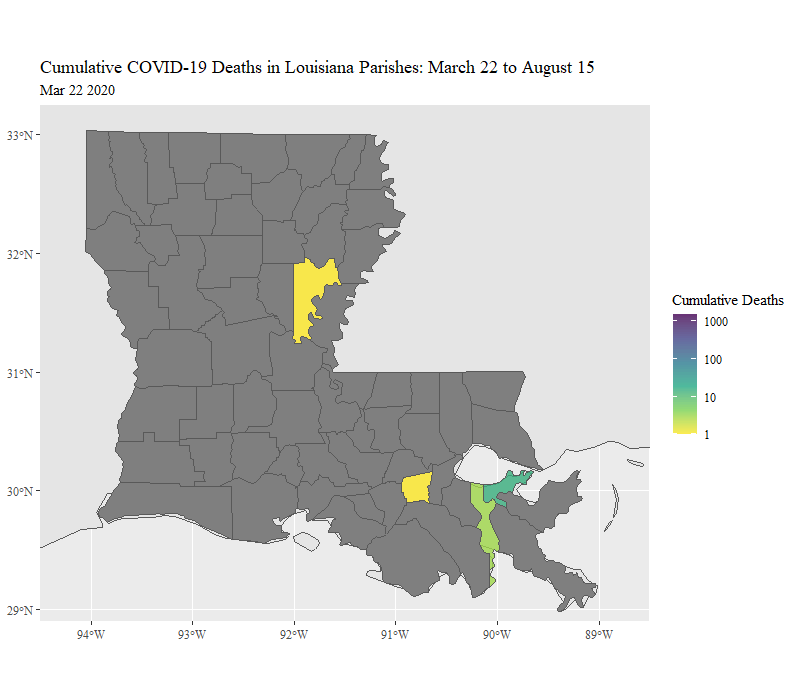

<div align="right">**Note: Toggle the "code" button to view/remove R code**</div>  
  
This page reviews a couple of pet projects I completed to familiarize myself with the availability of pandemic-related data in an effort to brainstorm for a research project on intervention effectiveness. I use data from an API that consolidates Johns Hopkins data related to cases and deaths (and many other topics I did not utilize): [COVID19() R Package](https://covid19datahub.io/). I clean and merge the COVID-19 data with simple additive indices of standardized variables from [Google's Community Mobility data](https://www.google.com/covid19/mobility/). I create a large, county-day panel data set for all counties larger than (and including) New Orleans, LA (because I wanted to see if Mardi Gras 2020 is visible in the data, which it is at the start of the first plot). Using animated .gif plots, I show how each of the five waves of COVID-19 "appears" in the publicly available data, focusing on daily deaths, 30-day-lagged mobility data (from Google), and 15-day-lagged new case data. My goal was to gain an understanding of differing patterns in order to inform future analysis that would attempt to deal with endogeneity and inform lag-timing for dependent variables.

Last, I structure the data as a map object using the [sf() package](https://r-spatial.github.io/sf/) and data from [rnaturalearth()](https://cran.r-project.org/web/packages/rnaturalearth/README.html) to understand how cases move geographically through space.

Unfortunately these data sets are too large to share the [GitHub site for this project](https://github.com/DavidRMcCoy/DavidRMcCoy.io), so I show how to download each API file with commented code and packages.

## Packages
```{r, warning = F, message = F}
library(tidyverse)
library(zoo)
library(viridis)
library(glue)
library(tools)
library(lubridate)
library(gifski)
library(gganimate)
library(summarytools)
library(forcats)
library(sf)
library(ggspatial)
# These are only needed if you are downloading the data from the APIs
# library(rnaturalearth)
# library(rnaturalearthdata)
# library(COVID19)

# Clear data
rm(list=ls())
```

# Bulding a County-Day Data Set to Understand the COVID-19 Waves

## Google Mobility Data and COVID() API
This shows how to load clean and merge the Google data and John Hopkins data from the COVID19() API. These are enormous, hierarchically structured data sets. The COVID-19 data comes as cumulative values, which must be converted to daily new counts. The Google Mobility data is the deviation from a fixed set of days at the start of the sample; thus, something similar to a county fixed-effect is included in this data; however, we can imagine how this type of fixed-effect would pose complex problems. For example, very cold counties will have stronger seasonal effects than temperate counties.    
```{r, warning = F, message = F}
# Load yearly data for US and bind to single data frame
g <- rbind(
  read_csv("data/2020_US_Region_Mobility_Report.csv"),
  read_csv("data/2021_US_Region_Mobility_Report.csv"),
  read_csv("data/2022_US_Region_Mobility_Report.csv"))
# Subset to appropriate geographical level and standardize ID variables
g <- g %>%
  filter(!is.na(census_fips_code) & !is.na(sub_region_2)) %>%
  select(-metro_area, -iso_3166_2_code) %>%
  rename(
    County = sub_region_2,
    State = sub_region_1) %>%
  select(-1, -2)
# Load saved data set from COVID19 API
usc <- readRDS("data/uscities.rds") %>%
  ungroup() %>%
  mutate(
    place_id = key_google_mobility,
    cases = confirmed) %>%
  select(id, place_id, date, deaths, cases, hosp, 13:30, population, latitude, longitude)

# Get time invariant vars from COVID data set to balance final set with pre-dated data
id <- usc %>%
  group_by(place_id) %>%
  summarize(
    population = population[1],
    latitude = latitude[1],
    longitude = longitude[1]) %>%
  ungroup() 

# Join Google data with invariant data
d <- full_join(g, id, by = "place_id") %>%
  # Filter out small counties
    filter(population>390000
           # filter out non-counties and Puerto Rico
           & !County %in% c("Kansas City", "New York City", "District of Columbia")
           & place_id != "ChIJJZ95DGVoA4wRfE4aUPoNFNI") %>%
  # Match COVID() package data to larger Google Data
  left_join(usc %>% select(-population, -latitude, -longitude), by = c("place_id", "date"))
```


## Mobility Index with Time Fixed Effects from Google's Public Data
## Rolling Averages of Deaths and Cases of COVID-19  

This creates the full data set that I will subset for several time periods to see how the pandemic changes during each wave of COVID-19:

1. Take centered z-scores of Google Mobility items and averaged indices of three most correlated items: recreation and retail, going to work, being at home (reversed).
2. To transform cumulative death and case panel data to county-day new deaths and cases, I group data by county and perform:
$$daily_{i,t} = cumulative_{i,t} - cumulative_{i,t-1}  $$
3. Transformation $T$ for daily new deaths and daily new cases is the seven-day moving average of the logged value of one plus daily counts per million residents:
$$T_{n,t} = (\frac{1}{7}) \sum_{i =n-3}^{n+3} p_{i,n-3} +...p_{i,n}+...p_{i,n+3}$$
Where $p_{n,t}$ equals the log of daily counts in county $n$ at time $t$ per million residents plus one: $$p_{n,t} = log(1+(\frac{daily_{i,t}}{population_i} 1,000,000))$$
4. Create the seven-day moving average of Google Mobility index; same as $T_{n,t}$ but $p_{n,t}$ is the mean of the three standardized Google Mobility items in county $n$ at time $t$.

Because a [reasonable estimate](https://www.thelancet.com/journals/lancet/article/PIIS0140-6736(20)30566-3/fulltext) of the expected value of time between exposure and death is one month, I lag the Google Mobility index by 30 days and lag new cases by 15 days. I should highlight that the relationships I expect to see in the data are exploratory and descriptive and cannot be expected to demonstrate causality in any direction. For this, I would need to go much further in eliminating endogeneity. I chose these three variables at these lagged points in time, because I am curious whether lagged community mobility and new cases are more associated with fewer deaths at $t = 0$ or whether this relationship is completely obscured (due to the endogenous and not modeled correlation between past deaths with present deaths).

```{r, warning = F, message = F}
# I need to re-scale, and scale() doesn't work well with dplyr
scale_me <- function(x){
  (x - mean(x, na.rm=TRUE)) / sd(x, na.rm=TRUE)
}

# Choose values for scales - deaths per million inhabitants
rescale = 1000000

shelter_county <- d %>%
  arrange(place_id, date) %>%
  mutate(
    # Date Variables
    date = as.Date(date),
    Date = format(as.Date(date), "%b %d %Y"),
    # Google Mobility Data
    Recreation = scale_me(retail_and_recreation_percent_change_from_baseline),
    Grocery = scale_me(grocery_and_pharmacy_percent_change_from_baseline),
    Parks = scale_me(parks_percent_change_from_baseline),
    Transit = scale_me(transit_stations_percent_change_from_baseline),
    Work = scale_me(workplaces_percent_change_from_baseline),
    n.Home = scale_me(- residential_percent_change_from_baseline) # must be reversed
    ) %>%
  rowwise() %>%
    mutate(
      Mobility = mean(c(Recreation, n.Home, Work), na.rm=T)) %>%
  ungroup() %>%
  group_by(place_id) %>%
# Must derive daily case count from grouped, lagged, cumulative. There are a few errors to remove.  
  mutate(
    # Daily Death Variables rolling avg
    deaths = ifelse(is.na(deaths), 0, deaths),
    dailydeaths = deaths - lag(deaths),
    dailydeaths  = ifelse(dailydeaths<0 , 0, dailydeaths),
    dailydeaths.pc.log = log(1 + ((dailydeaths/population) * rescale)),
    r.dailydeaths.pc.log = rollmean(dailydeaths.pc.log, k = 7, fill = NA),
    # Daily Case Variables rolling avg
    cases = ifelse(is.na(cases), 0, cases),
    dailycases = cases - lag(cases),
    dailycases = ifelse(dailycases<0 , 0, dailycases),
    dailycases.pc.log = log(1 + ((dailycases/population) * rescale)),
    r.dailycases.pc.log = rollmean(dailycases.pc.log, k = 7, fill = NA),
    # Mobility Rolling Mean
    r.Mobility = rollmean(Mobility, k = 7, fill = NA),
    # Lagged Variables for Analysis - These are for "size" so 0 -> 1
    r.dailycases.pc.log.L30 = 1 + lag(r.dailycases.pc.log, 30L),
    r.dailycases.pc.log.L15 = 1 + lag(r.dailycases.pc.log, 15L),
    r.Mobility.L30 = lag(r.Mobility, 30L)
    ) %>%
  ungroup() %>%
  # Drop unused variables
  select(County, State, Date, r.dailydeaths.pc.log, r.dailycases.pc.log.L15, r.Mobility.L30, place_id, date)
```

## The Full Data Set

Less than one percent of the data is missing. Most of the missing values are caused by the 15- and 30-day lags and the moving averages at the margins of the panel.
```{r, results = "asis", warning = FALSE, message = FALSE, class.source = 'fold-hide'}
print(
  dfSummary(shelter_county,
          plain.ascii  = FALSE,
          style        = "grid",
          graph.magnif = 0.75,
          valid.col    = FALSE,
          tmp.img.dir  = "/tmp",
          silent = TRUE),
  method = "render")
```

# Waves 1 and 2 of COVID-19

This is the first of three data transformations that feed directly into a script for creating animated scripts for visualizing county-day panel data. For each of the three subsets, I rescale the mobility index, so that the variable has a mean of zero and standard deviation of one. Next, I include time fixed-effects to remove daily-level shifts that affect all counties by subtracting the average value of all cases on that day from each county-day value. Thus, units are still able to vary systematically in respective county-level means; however, each county's daily move is above and beyond the common shock experienced through seasonality or overall changes. This is the case for all three wave plots.

```{r, warning = FALSE, message = FALSE}
# Define Start and End Dates
start.date = as.Date("2020-03-18")
end.date = as.Date("2020-09-30")

w12 <- shelter_county %>%
  # Filter start and end dates
  filter(date > start.date & date < end.date) %>%
  group_by(place_id) %>%
  mutate(
    # get a count of obs per county for animation
    n = 1:n(),
    # scale and center mobility based on subsample
    r.Mobility.L30 = scale_me(r.Mobility.L30)) %>%
  ungroup() %>%
  group_by(date) %>%
  mutate(
    # Get daily means for all cases to use as time fixed-effects
    mob_day_mean = mean(r.Mobility.L30, na.rm = T)) %>%
  ungroup() %>%
  mutate(
    # Take out daily shifts for all cases
    mob_time_fe = r.Mobility.L30 - mob_day_mean,
    Date = fct_reorder(Date, n)) 


```


## Visualizing Waves 1 and 2

Each point in the plot is a county with population greater than 390,000. The x-axis shows each counties mobility relative to its own baseline minus the deviation experienced on average by all counties. Without the time fixed-effect, there is a daily "wobble" of all units that impedes (already difficult) interpretation. The y-axis includes the logged deaths per million inhabitants as a seven-day moving average. The color and size of points are both measures of 

Testing and reporting infrastructure was urgently needed in order to deal with the pandemic. This visualization shows in real time how measurement of new cases (yellowness and size) emerges, improves, and stabilizes during the first months.

During the latter half, it shows how counties responded with robust lock downs in order to deal with local outbreaks. The data shows that when outbreaks emerged at $t=0$, points tend to shift leftward. During the latter half, there is a tendency for a downward slope among points. Unless lock downs can cause outbreaks and increased deaths (not plausible), the endogenous relationship between deaths at $t=0$ and deaths at $t-30$ is apparent in the downward slope in the data.

```{r, warning = FALSE, message = FALSE}

p <- ggplot(data = w12,
            aes(x=mob_time_fe, 
                y=r.dailydeaths.pc.log, 
                color=r.dailycases.pc.log.L15,
                size = r.dailycases.pc.log.L15)) +
  geom_point() + 
  #xlim(-40, 62) + ylim(0, 8) +
  scale_color_viridis(option="plasma", alpha = .4, 
                      limits=c(1, 1 + round(max(w12$r.dailycases.pc.log.L15), digits = 1)), trans = "log", 
                      breaks = c(1, round(max(w12$r.dailycases.pc.log.L15), digits = 0))) +
  theme(text=element_text(family="serif")) +
  labs(
    title = "COVID-19 Waves 1 and 2: Daily Deaths, Month-Lagged Mobility, and \n 15-Day-Lagged New Cases: All US Counties with 390K Residents \n {closest_state}",
    subtitle = "All values are 7-Day Rolling Averages",
    #caption = "Data Source: Google Mobility Data, NYT, COVID19 API \n Github: DavidRMcCoy",
    color = "New Cases \n (-15 Days)",
    y = "Daily Deaths per Million Residents (Log)",
    x = "Mobility Index (-30 Days): Using Google Mobility Data") +
  guides(size = "none") +
  transition_states(Date,
                    transition_length = 10,
                    state_length = 1,
                    wrap = F) +
  shadow_wake(wake_length = 0.004) + enter_fade() + exit_shrink()

# Render
c_s <- animate(p, nframes = (2 * max(w12$n)), detail=10)
anim_save("waves_1_2_mob_death.gif", animation=c_s)
c_s
```


# Wave 3 of COVID-19 (Delta)


**Note:** You can view the code by toggling the "code" button.

```{r, warning = FALSE, message = FALSE, class.source = 'fold-hide'}
# Define Start and End Dates
start.date = as.Date("2020-10-01")
end.date = as.Date("2021-03-30")

w3 <- shelter_county %>%
  # Filter start and end dates
  filter(date > start.date & date < end.date) %>%
  group_by(place_id) %>%
  mutate(
    # get a count of obs per county for animation
    n = 1:n(),
    # scale and center mobility based on subsample
    r.Mobility.L30 = scale_me(r.Mobility.L30)) %>%
  ungroup() %>%
  group_by(date) %>%
  mutate(
    # Get daily means for all cases to use as time fixed-effects
    mob_day_mean = mean(r.Mobility.L30, na.rm = T)) %>%
  ungroup() %>%
  mutate(
    # Take out daily shifts for all cases
    mob_time_fe = r.Mobility.L30 - mob_day_mean,
    Date = fct_reorder(Date, n)) 
```


## Visualizing Wave 3 of COVID-19 (Delta)

The third wave is distinct in at least two ways. First, during much of the panel, there is a period in which no counties are near zero. Unlike the latter half of the second wave, there is not an enduring downward slope to the distribution, but rather, there is a great deal of variation among counties over time. There seem to be moments in which movement toward the left on the x-axis results in fewer cases (smaller more purple points) 15 days later. Other times, the fluctuations seem arbitrary. 

Interestingly, near the end of the third wave, when deaths and cases at $t-15$ begin to diminish, counties begin to spread out across the x-axis. The mean of all counties for each day is fixed at zero, so we can't expect all cases to shift left or right. However, this wide spread at the end of the third wave meant that some cities were much quicker to return to higher levels of mobility than other counties, which is in line with the growing backlash against lock downs at the time.

```{r, warning = FALSE, message = FALSE, class.source = 'fold-hide'}

p <- ggplot(data = w3,
            aes(x=mob_time_fe, 
                y=r.dailydeaths.pc.log, 
                color=r.dailycases.pc.log.L15,
                size = r.dailycases.pc.log.L15)) +
  geom_point() + 
  #xlim(-40, 62) + ylim(0, 8) +
  scale_color_viridis(option="plasma", alpha = .4, 
                      limits=c(1, 1 + round(max(w3$r.dailycases.pc.log.L15), digits = 1)), trans = "log", 
                      breaks = c(1, round(max(w3$r.dailycases.pc.log.L15), digits = 0))) +
  theme(text=element_text(family="serif")) +
  labs(
    title = "COVID-19 Wave 3: Daily Deaths, Month-Lagged Mobility, and \n 15-Day-Lagged New Cases: All US Counties with 390K Residents \n {closest_state}",
    subtitle = "All values are 7-Day Rolling Averages",
    color = "New Cases \n (-15 Days)",
    y = "Daily Deaths per Million Residents (Log)",
    x = "Mobility Index (-30 Days): Using Google Mobility Data") +
  guides(size = "none") +
  transition_states(Date,
                    transition_length = 10,
                    state_length = 1,
                    wrap = F) +
  shadow_wake(wake_length = 0.004) + enter_fade() + exit_shrink()

#Render
c_s <- animate(p, nframes = (2 * max(w3$n)), detail=10)
#anim_save("wave_3_mob_death.gif", animation=c_s)
c_s
```


# Waves 4 and 5 of COVID-19
```{r, warning = FALSE, message = FALSE, class.source = 'fold-hide'}
# Define Start and End Dates
start.date = as.Date("2021-07-15")
end.date = as.Date("2022-04-28")

w45 <- shelter_county %>%
  # Filter start and end dates
  filter(date > start.date & date < end.date) %>%
  group_by(place_id) %>%
  mutate(
    # get a count of obs per county for animation
    n = 1:n(),
    # scale and center mobility based on subsample
    r.Mobility.L30 = scale_me(r.Mobility.L30)) %>%
  ungroup() %>%
  group_by(date) %>%
  mutate(
    # Get daily means for all cases to use as time fixed-effects
    mob_day_mean = mean(r.Mobility.L30, na.rm = T)) %>%
  ungroup() %>%
  mutate(
    # Take out daily shifts for all cases
    mob_time_fe = r.Mobility.L30 - mob_day_mean,
    Date = fct_reorder(Date, n)) 
```


## Visualizing Waves 4 and 5

The most salient difference about waves four and five is the fact that a subset of counties (those in Florida, primarily) no longer appear comparable to the rest of the country. As [Johns Hopkins notes](https://coronavirus.jhu.edu/region-data-notes/florida), Florida began reporting cases once per month, which results in many near-zero values followed by incomparable values that cannot be treated as county-day panel data. Aside from this distinction, there is little different from the data in the third wave. There is a mix of expected, systematic patterns of moving left accompanied by random noise. Additionally, the end of the wave exhibits greater spread/polarization among cases as some counties revert more quickly from lock down at the end of the wave.


```{r, warning = FALSE, message = FALSE, class.source = 'fold-hide'}

p <- ggplot(data = w45,
            aes(x=mob_time_fe, 
                y=r.dailydeaths.pc.log, 
                color=r.dailycases.pc.log.L15,
                size = r.dailycases.pc.log.L15)) +
  geom_point() + 
  #xlim(-40, 62) + ylim(0, 8) +
  scale_color_viridis(option="plasma", alpha = .4, direction = 1,
                      limits=c(1, 1 + round(max(w45$r.dailycases.pc.log.L15), digits = 1)), 
                      trans = "log", 
                      breaks = c(1, round(max(w45$r.dailycases.pc.log.L15), digits = 0))) +
  theme(text=element_text(family="serif")) +
  labs(
    title = "COVID-19 Waves 4 and 5: Daily Deaths, Month-Lagged Mobility, and \n 15-Day-Lagged New Cases: All US Counties with 390K Residents \n {closest_state}",
    subtitle = "All values are 7-Day Rolling Averages",
    color = "New Cases \n (-15 Days)",
    y = "Daily Deaths per Million Residents (Log)",
    x = "Mobility Index (-30 Days): Using Google Mobility Data") +
  guides(size = "none") +
  transition_states(Date,
                    transition_length = 10,
                    state_length = 1,
                    wrap = F) +
  shadow_wake(wake_length = 0.004) + enter_fade() + exit_shrink()

# Render
c_s <- animate(p, nframes = (2 * max(w45$n)), detail=10)
#anim_save("waves_4_5_mob_death.gif", animation=c_s)
c_s
```


# Mapping Louisiana's COVID-19 Death Data

This code cleans and combines COVID-19 data from the [COVID19()](https://covid19datahub.io/) API with map objects (sf) from the [rnaturalearth()](https://cran.r-project.org/web/packages/rnaturalearth/README.html) package data. 


## Visualizing Cumulative COVID-19 Deaths in Louisiana

I clean up the COVID-19 data; subset the data based on date and location; parse map data with identification variables that match the COVID-19 data for Louisiana Parishes; merge these two data sets. Next, I specify spatial limits and create one static image for each calendar date in the sample. Each image includes a layer that is a blank map of Louisiana and a layer that contains the cumulative death data for that day as the fill for each Parish. Finally, I use the gifsky() package to save the .gif file and knitr to print it. Dark grey Parishes are those that had yet to see a death from COVID-19 in the panel, according to official data.

As expected, Orleans and Jefferson Parishes experience a rapid and early acceleration in deaths, due to the unfortunate timing of Mardi Gras in 2020. The data suggests that urban density mattered more than outright population size, as Lafayette Parish experienced a much slower climb than Caddo Parish, even though they are similar in overall size and Lafayette hosts the state's second largest regional Mardi Gras celebration.

```{r, warning = FALSE, message = FALSE}
# Clear 
rm(list = ls())
# Define Start and End Dates
start.date = as.Date("2020-03-22")
end.date = as.Date("2020-08-15")
#keep <- c("Louisiana", "Mississippi", "Texas", "Arkansas")
# Define data subset as my native state of Louisiana
keep <- c("Louisiana")

# Create a map data (sf) object from rnaturalearth() package
# world <- ne_countries(scale = "medium", returnclass = "sf")
# saveRDS(world, "world.rds")
world <- readRDS("data/world.rds")

# County/Parish COVID-19 data saved from COVID19() API
usc <- readRDS("data/uscities.rds")
# Clean and subset COVID-19 data
uscities <-  usc %>%
  filter(
    administrative_area_level_2 %in% keep & 
      date >= start.date & date <= end.date) %>%
  group_by(id) %>%
  mutate(
    Parish = gsub("St.", "St", administrative_area_level_3),
    Parish = gsub("LaSalle", "La Salle", Parish),
    State = administrative_area_level_2,
    Date = format(as.Date(date), format="%b %d %Y"),
    n = 1:n()) %>%
  ungroup() %>%
  # Keep until August 15, 2020
  #filter(n < 156) %>%
  select(State, Parish, Date, n, deaths, date)
  
# Create object that can link COVID-19 data to sf map object 
# You will need to load all packages to run this code
# sf_counties <- st_as_sf(map("county", plot = FALSE, fill = TRUE))
# saveRDS(sf_counties, "data/sf_counties.rds")

# Load saved spatial data from sf API - using code above this
sf_counties <- readRDS("data/sf_counties.rds") %>%
  # Parse using ID variable to create matching names.
  mutate(
    State = toTitleCase(str_split_fixed(ID, ",", 2)[,1]),
    Parish = toTitleCase(str_split_fixed(ID, ",", 2)[,2])) %>%
  # Keep Louisiana's Parishes
  filter(State %in% keep) %>%
  select(-ID)

# Create a balanced data frame to hold missing values: use date length
balanced <- data.frame(
  Parish = rep(sf_counties$Parish, each = length(start.date:end.date)),
  date = as.Date(rep(start.date:end.date, times = 64)))

counties <- left_join(balanced, uscities, by=c("Parish", "date")) 
counties <- left_join(sf_counties, counties, by = "Parish") %>%
  group_by(Parish) %>%
  mutate(
    Date = format(as.Date(date), format="%b %d %Y"),
    n = 1:n()) %>%
  ungroup()

rm(usc)

makeplot <- function(){
  datalist <- split(counties, counties$date)
  lapply(datalist, function(counties){
    p <- ggplot(data = world) +
            geom_sf() +
            geom_sf(data = counties, aes(fill = deaths)) +
            scale_fill_viridis_c( alpha = .8, direction=-1, limits=c(1,1501), trans = "log", breaks = c(1, 10, 100, 1000)) +
            coord_sf(xlim = c(-94.5, -88.5), ylim = c(28.9, 33.25), expand = FALSE) +
            labs(subtitle=counties$Date, 
                 title="Cumulative COVID-19 Deaths in Louisiana Parishes: March 22 to August 15", 
                 fill = "Cumulative Deaths") +
  theme(text=element_text(family="serif"))
    print(p)
  })
}
save_gif(makeplot(), gif_file = "louisiana.july2022.gif", width = 800, height = 700, res = 100, delay=0.1, progress = FALSE)



```


